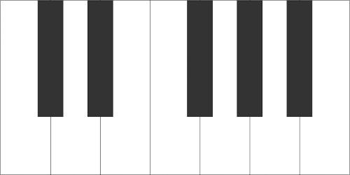

# Virtualso.js
A collection of customizable canvas-rendered virtual instruments.
<br/>
<br/>

## Contents
- [Installation](#installation)
- [Basic Usage](#usage)
- [Applying Sound](#sounds)
- [Instruments](#instruments) - Base Virtual Instrument Class
    - [Viano](#viano) - Virtual Piano
    - [VString](#VString) - Virtual Strings (Guitar, Violin, etc...)
    - [VDrumpad](#VDrumpad) - Virtual Drumpad 

# Installation
- Method 1 - Download the latest release here:
    - [Minified](https://rawgit.com/) 
    - [Uncompressed](https://rawgit.com/)
- Method 2 - Using npm
```bash
npm install virtualso
```

# Usage
## Browser
Add Virtualso to your HTML page
```HTML
...
    <script src='path/to/Virtualso.js'></script>
...
```
## Nodejs
Virtualso is more at home in the browser, but that doesn't mean you can't take it other places 
```javascript
var Virtualso = require('Virtualso');
```
# Sounds
Though Virtualso is great for applications that only require visual aides, Virtualso can also be 
configured to play sounds.
For size and copyright reasons the sounds themselves are not included.

# Instruments
All instruments share at least these fields and methods.

```javascript
var options = {
    /*
     * The not scheme to be used with the instrument
     */
    scheme : Virtualso.defaultScheme // ["C", "C#", "D" ...]
    /*
     * Width of view generated
     */
    width : 400,
    /*
     * Height of view generated
     */
    height : 200,
    /*
     * Instrument's rotation in radians
     * Setting this rotation DOES NOT rotate the view itself, but the elements within it.
     * Make sure the view is big enough to contain the rotated div
     * To rotate the view itself use CSS or 
     */
    rotation : 0,

};
var instrument = new Virtualso.Instrument( options );
// methods
instrument.addEventListener(String, Function);
```
## Viano
A Virtual Piano. 

```javascript
var options = {
    /*
     * Specify the key range of the virtual keyboard
     *
     * Possible values:
     * ["C", 12] (default) - Start at C0 and generate 12 keys
     * ["C", "A"] - Start at C0 and generate to A0
     * ["A0", "C8"] - Start at A0 and Generate to C8 (standard 88 key piano)
     * ["A0", 88] - Start at A0 and generate 88 keys
     */
    range : ["C", 12],
    /*
     * Choose when to display the name of the note on the key
     * Possible values:
     * true - Always display noteName 
     * false - Never display noteName
     * "triggered" - Display only on triggered notes
     * "untriggered" - Display only on untriggered notes (why? I dunno, I just offer solutions okay)
     * [...'notes'] - String of specific notes to 
     */
    noteNames : false,
    /*
     * Turn keyboard control of Viano on/off
     * consider using the toggleInteraction method if you're using multiple Viano instances and 
     * are experiencing a problem with the Viano playing on all of them
     */
    keyboardControl : true,
    /*
     * Map keys on keyboard to keys on Viano
     * Maps on the range [C3, C5]
     */
    keyMap : Instrument.defaultKeymap
};

// Create a new Viano
var piano = new Virtualso.Viano( options );
// Add the Viano's canvas to the DOM
document.body.appendChild(piano.view); 
```

## VString
VString represents an arbitrarily stringed instrument. Each string vibrates at a particular frequency when clicked.

## VDrumPad

The Virtual DrumPad class
